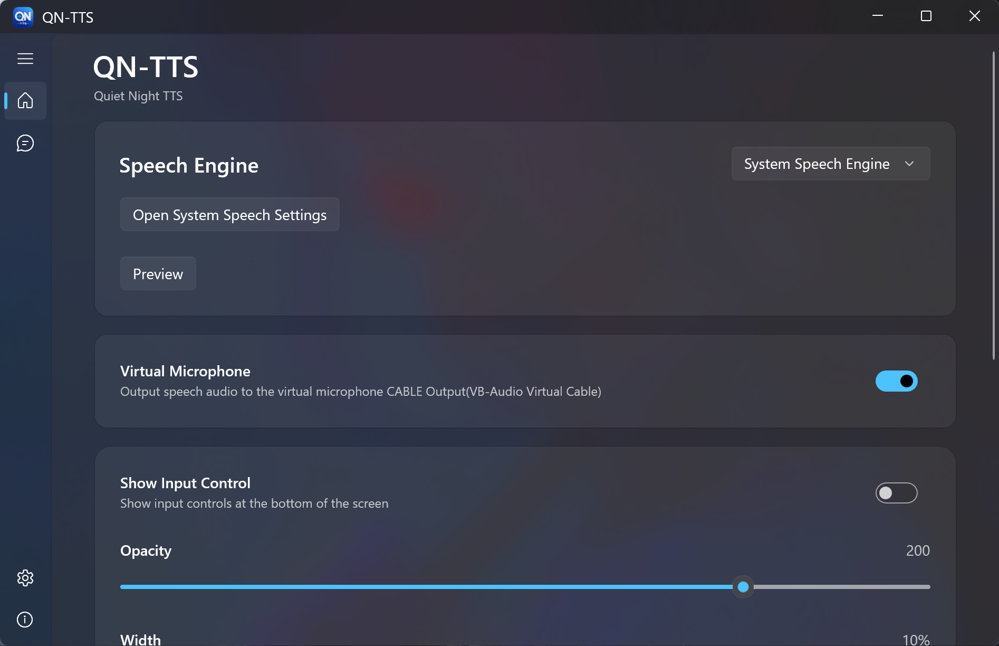
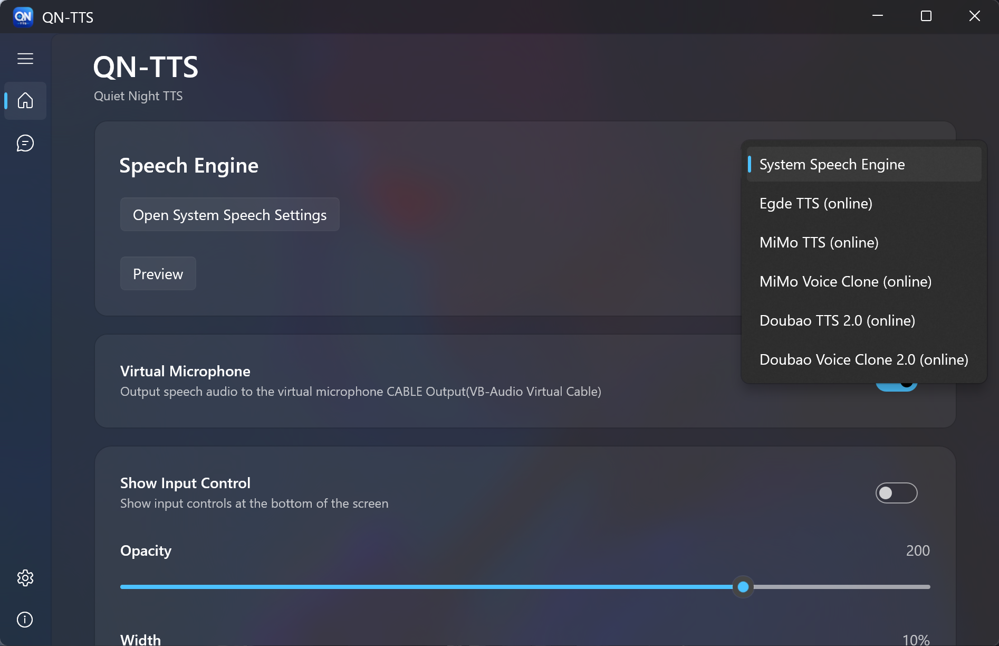
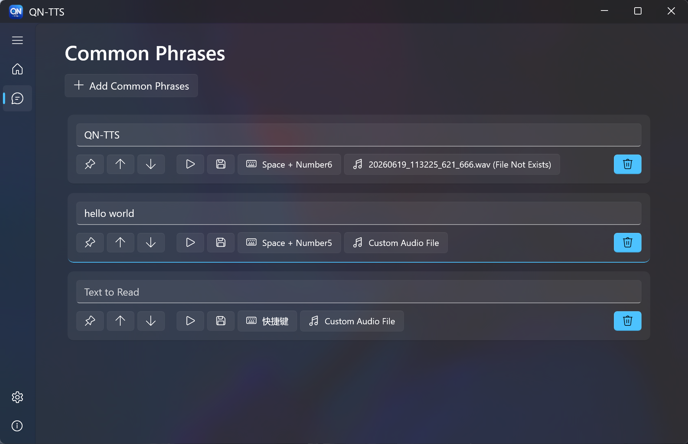
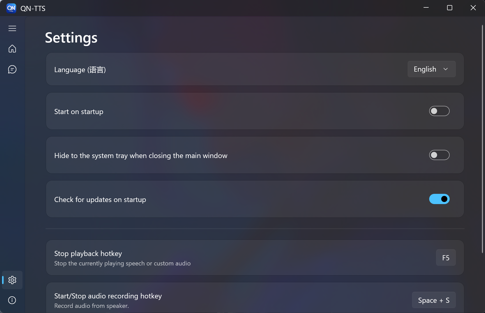

🌐 [中文](README.md) / English

#  QN-TTS (Quiet Night TTS)

A text-to-speech (TTS) tool designed for in-game voice communication and other voice-related scenarios.

## Features

- Supports multiple TTS engines  
- Fast text input  
- Voice cloning (depending on the selected engine)  
- Global hotkeys  
- Common phrases
- Speaker audio recording  

## Download

Please visit the [Releases](https://github.com/InsistonTan/QN-TTS/releases) page to download the latest version.

## System Requirements

- Windows 10 (19041 or later)  
- Windows 11

## Screenshots

  
  

  
  

## Issue Reporting

You are welcome to submit issues or feature requests via [Issues](https://github.com/InsistonTan/QN-TTS/issues).

## Support the Project

QN-TTS is completely free to use.

If you find this software helpful, you are welcome to support its continued development and maintenance via [Donate](DONATE.md).

## License

Copyright © 2026 InsistonTan

All Rights Reserved.

This repository is used only for software distribution and issue tracking. The source code is currently not publicly available.
