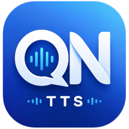

#  QN-TTS (Quiet Night TTS)

一款文本转语音（TTS）工具, 可用于游戏内或其他语音场景的文字转语音交流。

## 功能特点

- 支持多种 TTS 引擎
- 快速输入窗口
- 声音克隆（取决于所选引擎）
- 全局快捷键
- 常用语
- 扬声器音频录制

## 下载

请前往 [Releases](https://github.com/InsistonTan/QN-TTS/releases) 页面下载最新版本。

## 系统要求

* Windows 10（19041 及以上）
* Windows 11

## 问题反馈

欢迎通过 Issues 提交问题反馈或功能建议。

## 支持项目

QN-TTS 完全免费。

如果本软件对您有所帮助，欢迎[赞助支持](DONATE.md)项目的持续开发与维护。

## 许可证

Copyright © 2026 QN-TTS

All Rights Reserved.

本仓库仅用于软件发布与问题反馈，源码暂不公开。

